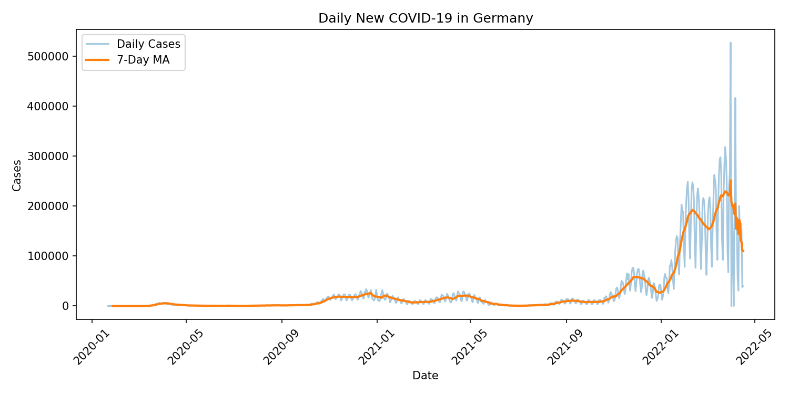
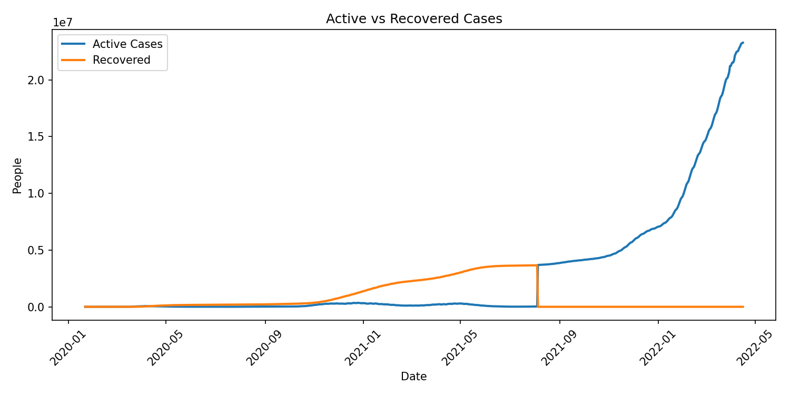

# COVID-19 Data Analysis (Germany)

A Python data analysis project exploring the progression of **COVID-19 cases in Germany** using **pandas**, **matplotlib**, and **NumPy**, based on live data from the [COVID-19 Dataset by Our World in Data](https://github.com/datasets/covid-19).

---

## Overview

This project performs a **complete data analysis workflow**, demonstrating real-world data science and visualization techniques.  

It includes:

✅ Loading live COVID-19 data directly from GitHub  
✅ Cleaning and preprocessing data with **pandas**  
✅ Calculating **daily confirmed**, **deaths**, **recovered**, and **active** cases  
✅ Creating **7-day moving average** trends  
✅ Plotting visual insights using **matplotlib**  
✅ Exporting clean datasets and summary reports as CSV files  

---

### Daily New Cases with 7-Day Moving Average
Shows infection trends over time for Germany.

### Active vs Recovered Cases
Tracks how recovery compares with active cases.

